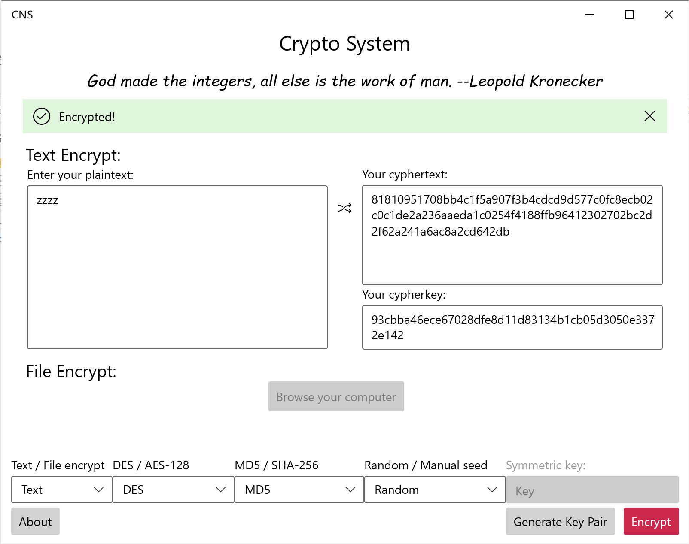

# CNS
## CNS -- Cryptographic is Not Simple

Crypto System designed for cryptographic class in southeast university

## Features

Text Encrypt/Decrypt, File Encrypt/Decrypt

### Algorithms supported

* DES
* AES-128
* RSA 200 bit
* MD5
* SHA-256

### Highlights

* Core algorithms written in pure C/C++, super fast!
* Beautiful and modern UI
* Provide asymmetric operations support using Windows Thread Pools
* Written with C++/winrt, Microsoft's C++17 language projection for Windows Runtime (WinRT) APIs

## Third party libraries
[WinUI](https://aka.ms/winui)

[Microsoft/cppwinrt](https://aka.ms/cppwinrt)

[Silenceneo-xw/RSA](https://www.cnblogs.com/Silenceneo-xw/p/6718334.html)

## Acknowledgements

Xiaowen Wang, Zhouhong Wang, Mengjia Ding

This project can not be done without the help of these people, who had helped me a lot during the hard times.

## Licence

Copyright © 2021 Zeping Zhang

This program is free software: you can redistribute it and/or modify
it under the terms of the GNU General Public License as published by
the Free Software Foundation, either version 3 of the License, or
(at your option) any later version.

This program is distributed in the hope that it will be useful,
but WITHOUT ANY WARRANTY; without even the implied warranty of
MERCHANTABILITY or FITNESS FOR A PARTICULAR PURPOSE.  See the
GNU General Public License for more details.

You should have received a copy of the GNU General Public License
along with this program.  If not, see <http://www.gnu.org/licenses/>.